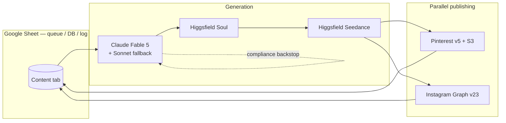

[← Back to Social Media Automation](README.md) · [← Portfolio](../README.md)

# Architecture — Beauty Affiliate Pipeline

This document describes how the pipeline is put together: the single-workflow structure, the row lifecycle, the dual-platform posting model, and how failures are isolated and contained. It describes the system *as-built* and stops short of source code.

---

## System Overview

The entire pipeline is **one n8n workflow** (`mkVVxu84SngCQxrM`, 67 nodes) running on a schedule. It is built around a **Google Sheet that serves three roles at once**: a priority-ordered job queue, the content database, and the status/error log. One scheduled run processes exactly one sheet row end-to-end.

Execution order is n8n's `v1` (deterministic), and the workflow is configured to save **both success and error executions**, so any run — including a failed one — can be replayed and inspected node-by-node.



---

## The Row Lifecycle

A row's `status` column is the single source of truth for where it is in the pipeline:

```
ready → processing → generated → ┬→ posted      (both platforms succeeded)
                                 ├→ partial     (one platform succeeded)
                                 ├→ failed       (generation or both platforms failed)
                                 ├→ rejected     (human rejected at approval gate)
                                 └→ skipped      (platform flags excluded it)
```

`Mark Processing` locks the row before any generation begins, preventing a second concurrent run from grabbing the same item.

---

## Stage-by-Stage

### 1 · Selection & Gating

| Node | Type | What it does |
|---|---|---|
| Schedule Trigger | `scheduleTrigger` | Cron `0 9,12,15,18,21 * * *` — 5×/day, America/New_York |
| Config | `set` | Central control panel: `approvalEnabled`, `resetCircuit`, `circuitBreakerThreshold=3`, `igDailyCap=2`, `videoDuration=10`, `igGraphVersion`, `igUserId`, `notifyEmail`, `summaryEmailAlways` |
| Get Content Rows | `googleSheets (read)` | Reads the "Content" tab |
| Pick Next Item | `code` | Reads circuit-breaker state from static data; if `consecutiveFailures ≥ threshold` emits `gate:'circuit'`. Else filters rows to `status=ready` (with product + affiliate URL), sorts by priority then id, takes the top, counts today's IG posts for the cap, sets `postToPinterest` / `postToInstagram` flags. Emits `proceed` / `none` / `circuit` |
| Gate | `switch (3-way)` | `proceed` → Mark Processing · `none` → No-Op · `circuit` → Gmail alert |

### 2 · AI Content Generation

| Node | Type | What it does |
|---|---|---|
| Mark Processing | `googleSheets (update)` | Locks the row as `processing` |
| Build Claude Prompt | `code` | Assembles system+user prompt; selects a video preset (`ugc` / `unboxing` / `product_review` / `testimonial`), injects product brief + today's date for seasonal angles, embeds platform + compliance rules. Targets `claude-fable-5`, temp 0.8, max_tokens 3000 |
| Claude Generate Content | `httpRequest` | Anthropic `/v1/messages` primary call (3 retries); hard error routes to fallback |
| Claude Fallback (Sonnet) | `httpRequest` | Re-runs the same prompt on `claude-sonnet-4-6`; its failure routes to the generation-failure rail |
| Parse Content JSON | `code` | Strips fences, extracts + validates JSON, then **hard-enforces** limits + compliance (clamp Pinterest title/description, strip URLs from pin text, force-append disclosure + `#CommissionsEarned`, normalize IG hashtags ≤25, guarantee `#ad` + "Link in bio" + disclosure line) |

### 3 · Two-Stage Generative Video

| Node | Type | What it does |
|---|---|---|
| HF Generate Image | `httpRequest` | Higgsfield Soul `POST /higgsfield-ai/soul/standard` — `{prompt, aspect_ratio:'9:16', resolution:'720p'}` |
| Wait Image → Check Image Status → Image Status Switch | `wait`/`httpRequest`/`switch` | 10s poll loop; routes `completed` / `failed-or-timeout` (`$runIndex ≥ 24`) / `still-processing` (loops back) |
| Capture Image URL | `code` | Extracts the cover image URL from any response shape |
| HF Generate Video | `httpRequest` | Higgsfield Seedance `POST /bytedance/seedance/v1/pro/image-to-video` — `{image_url, prompt, duration}` |
| Wait Video → Check Video Status → Video Status Switch | `wait`/`httpRequest`/`switch` | 20s poll loop, timeout at `$runIndex ≥ 40` |
| Assemble Post Package | `code` | Builds the **canonical downstream item** that every posting node references via `$('Assemble Post Package')` |
| Save Asset URLs | `googleSheets (update)` | Writes `status=generated` + video/cover URLs |

### 4 · Optional Human Approval

| Node | Type | What it does |
|---|---|---|
| Approval Enabled? | `if` | Branch on the Config toggle |
| Send Approval Email | `gmail` | HTML email with video/cover links + both platforms' copy + Approve/Reject buttons wired to `$execution.resumeUrl` |
| Wait For Approval | `wait (webhook)` | Pauses ≤12h; no action = auto-reject |
| Approved? | `if` | `query.action === 'approve'` → Ready To Post; else → Mark Rejected |

### 5 · Parallel Dual-Platform Publishing

`Ready To Post` (No-Op) fans out to both branches simultaneously.

**Pinterest branch:** `PIN Should Post?` → Register Media (`POST /v5/media`) → Download Video (binary) → Upload To S3 (multipart, signed params) → Wait 15s → poll media status → `PIN Media Switch` (`succeeded` / `failed` / loop, timeout `$runIndex ≥ 30`) → Create Pin (`POST /v5/pins`, `source_type: video_id` + cover) → Log Success. Failures funnel through `PIN Build Error` → `PIN Log Failure`. Skips log `pinterest_status=skipped`.

**Instagram branch:** `IG Should Post?` → Create Container (`POST /{igUserId}/media`, `media_type=REELS`, `share_to_feed=true`) → Wait 20s → poll container `status_code` → `IG Container Switch` (`FINISHED` / `ERROR-EXPIRED` / loop, timeout `$runIndex ≥ 30`) → Publish Reel (`/media_publish`) → Log Success. Failures funnel through `IG Build Error` → `IG Log Failure`.

Both branches end at a No-Op (`PIN Done` / `IG Done`) that joins `Merge Platform Results` on inputs 0 and 1.

### 6 · Verdict & Reporting

| Node | Type | What it does |
|---|---|---|
| Merge Platform Results | `merge` | Combines both branch outputs by position (includes unpaired) |
| Compute Final Status | `code` | Inspects which log nodes ran → `posted` / `partial` / `failed` / `skipped`; updates circuit-breaker static data (reset on success/partial, increment on full failure); decides whether to email a summary |
| Update Final Row Status | `googleSheets (update)` | Writes the final status |
| Summary Needed? → Send Run Summary | `if` → `gmail` | Per-run report (Pinterest ✅/⏭/❌, Instagram ✅/⏭/❌, video link, consecutive-failure count) |

### 7 · Generation-Failure Rail

Any generation-stage error → `Record Generation Failure` (increments circuit counter) → `Log Generation Failure` (sheet `status=failed` + `error_log`) → `Alert Generation Failure` (Gmail).

---

## Data Flow

**Input:** one "Content" sheet row — `id, priority, status, product_name, brand, category, price_range, key_benefits, target_keywords, affiliate_program, affiliate_url, platforms, video_preset, pinterest_board_id, pinterest_board_name`.

| Step | Transform |
|---|---|
| Selection | row → selected item + config + gate decision |
| Generation | item → Claude prompt → JSON bundle → compliance-clamped content object |
| Image | `image_prompt` → Higgsfield Soul → `cover_image_url` |
| Video | `video_prompt` + cover → Higgsfield Seedance → `video_url` → assembled package |
| Approval | package → (optional) approve/reject decision |
| Publish | package → Pinterest pin id / Instagram media id |
| Verdict | branch results → merged status + circuit state |

**Output:** a published Pinterest video pin and/or Instagram Reel, a fully-updated sheet row (IDs, timestamps, status, error_log, asset URLs), and an email run summary.

---

## Error Handling & Resilience

- **Per-node:** API nodes use `retryOnFail` (2–3 tries, 5–15s backoff) and `onError: continueErrorOutput` to route failures rather than crash; sheet/Gmail nodes use `continueRegularOutput`.
- **Two-model fallback:** Claude primary failure → Sonnet fallback → generation-failure rail.
- **Bounded polling:** every status loop has a `$runIndex` cutoff (image 24, video 40, Pinterest media 30, IG container 30) — no infinite loops.
- **Per-platform isolation:** Pinterest and Instagram fail independently; each builds an error object and logs to its own sheet columns; the run still reports `partial`.
- **Circuit breaker:** consecutive failures tracked in workflow static data; at threshold (3) the Gate halts new work and emails an alert; reset via the `resetCircuit` Config flag.
- **Approval timeout:** 12h no-response = auto-reject (nothing posts).
- **Notifications:** generation-failure email, circuit-breaker email, per-run summary email.

---

## Interesting Technical Decisions

1. **Compliance enforced twice** — once in the LLM system prompt and again as a deterministic code backstop (URL stripping, disclosure injection, `#ad` / `#CommissionsEarned`, hashtag normalization). A sloppy model response can't ship a non-compliant post.
2. **A single canonical `Assemble Post Package`** node that every downstream node references via `$('Assemble Post Package')`, decoupling posting logic from the linear item flow and surviving the parallel split.
3. **Self-contained polling loops** built from `Switch + Wait + $runIndex` instead of n8n's native polling — explicit completed/failed/timeout branches with a predictable max wait per stage.
4. **Circuit breaker via `$getWorkflowStaticData('global')`**, which persists only across production/scheduled runs — a deliberate choice so manual test runs don't pollute the failure counter.

---

## Integrations / APIs

- Google Sheets API (OAuth2)
- Anthropic Messages API (`/v1/messages`)
- Higgsfield `platform.higgsfield.ai` — `/higgsfield-ai/soul/standard`, `/bytedance/seedance/v1/pro/image-to-video`, `/requests/{id}/status`
- Pinterest v5 — `/v5/media`, `/v5/media/{id}`, `/v5/pins`
- Instagram Graph API v23.0 — `/{igUserId}/media`, `/{containerId}`, `/{igUserId}/media_publish`
- Gmail API (OAuth2)
- AWS S3 presigned upload endpoint (returned by Pinterest)

Credentials are referenced by exact name (`Anthropic API`, `Google Sheets account`, `Gmail account`, `Higgsfield API`, `Pinterest OAuth2`, `Instagram Graph Token`) — no secrets are stored in the workflow JSON.

---

*Part of the [Aether AI automations portfolio](../README.md).*
