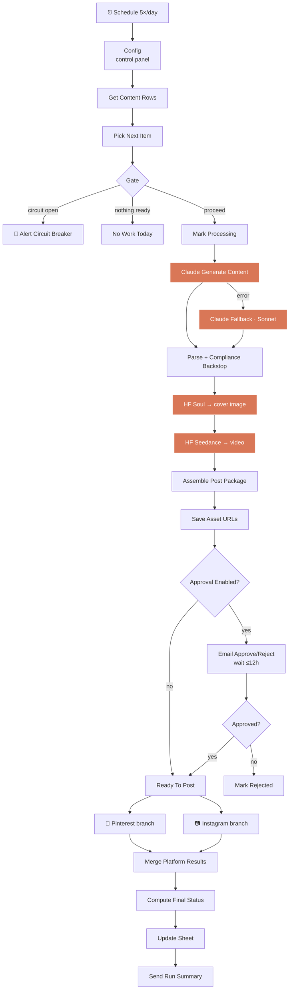

[← Back to AI Automations Portfolio](../README.md)

# Beauty Affiliate Pipeline — AI Content Factory for Pinterest + Instagram

**A scheduled, AI-driven content factory that turns a single Google Sheet row into an AI-written + AI-generated vertical beauty video and publishes it as both a Pinterest video pin and an Instagram Reel — with FTC/ASA affiliate compliance enforced twice, an optional human approval gate, and account-safety guardrails built in.**


> 🟡 **Status: built and deployed, awaiting activation** (credential wiring + Sheet ID / IG User ID). A 67-node single-workflow pipeline. Documented as-built.

---

## The Problem

Running an affiliate beauty account by hand is death by a thousand small tasks. Per product, every time:

- Write SEO-optimized Pinterest copy (title, description, alt-text)
- Write an Instagram caption with 15–25 researched hashtags
- Shoot or edit a 9:16 UGC-style video
- Post to two platforms with two different APIs
- Get the FTC/ASA disclosures exactly right (`#ad`, affiliate disclosure, `#CommissionsEarned` for Amazon, no link shorteners)
- Track what went out, where, and when

Do that five times a day across two platforms and the real risk isn't just time — it's a slip-up that ships a **non-compliant post** or an account that gets throttled for over-posting.

## The Solution

One n8n workflow that automates the entire chain from **a single spreadsheet row per run**: AI copywriting, two-stage generative video, compliance enforcement, an optional email approval step, and parallel dual-platform posting — all while protecting the accounts with a **per-day Instagram cap** and a **consecutive-failure circuit breaker**.

The Google Sheet *is* the job queue, the content database, and the status/error log all at once. Drop in rows marked `ready`; the pipeline picks them up on schedule, processes one per run, and writes back every ID, status, and timestamp.

---

## What It Does — Per Run

```
⏰ Schedule (5×/day: 9am, 12pm, 3pm, 6pm, 9pm ET)
   │
   ▼
Pick Next Item   Circuit-breaker check → filter rows to status=ready →
                 sort by priority → enforce IG daily cap → set per-platform flags
   │
   ├─ circuit open → 🚨 Gmail alert, halt
   ├─ nothing ready → quiet no-op
   ▼ proceed
Mark Processing (row lock)
   ▼
Claude Generate Content   One call → structured JSON bundle:
   (Fable 5, Sonnet         Pinterest copy + IG caption/hashtags + image & video prompts.
    fallback on error)      Fails over to Sonnet 4.6 automatically.
   ▼
Parse + Compliance Backstop   Clamp lengths, strip URLs from pin text, force-append
                              disclosure + #ad + #CommissionsEarned, normalize hashtags
   ▼
Higgsfield Soul   text → 9:16 720p cover image   (bounded 10s poll loop)
   ▼
Higgsfield Seedance   image → ~10s video         (bounded 20s poll loop)
   ▼
Save Asset URLs → Approval gate (optional)
   │   Send approval email with Approve/Reject buttons → wait ≤12h → auto-reject on timeout
   ▼ approved
Ready To Post  ──fan-out──┬─────────────────────────┬──
                          ▼                         ▼
              📌 Pinterest branch          📷 Instagram branch
              register media → S3 upload   create Reels container →
              → poll → create pin          poll → publish reel
                          └──────────┬──────────────┘
                                     ▼
                    Merge → Compute Final Status (posted / partial / failed / skipped)
                          → update sheet → email run summary
```

Both posting branches **fail independently** and merge back into a single verdict, so a Pinterest outage still lets the Instagram Reel ship — and the run reports `partial` rather than `failed`.

---

## Architecture at a Glance



See **[ARCHITECTURE.md](ARCHITECTURE.md)** for the full node-by-node breakdown of all 61 functional nodes.

---

## Tech Stack

| Layer | Technology | Why |
|---|---|---|
| **Orchestration** | n8n (executionOrder v1) | Single 67-node workflow; saves all success + error executions for debugging |
| **Job queue + DB + log** | Google Sheets (read + 9 update points) | One sheet is the queue, the content database, and the status/error log — the client can see and edit it directly |
| **LLM** | Claude Fable 5 (primary) → Claude Sonnet 4.6 (auto-fallback) | One call generates the entire structured content bundle; two-model resilience |
| **Generative video** | Higgsfield Soul (text→image) + Seedance (image→video) | Two-stage: generate a strong first frame, then animate it |
| **Pinterest** | Pinterest API v5 (+ AWS S3 presigned upload) | Register media → S3 multipart upload → create video pin |
| **Instagram** | Instagram Graph API v23.0 (Meta) | Reels container → publish |
| **Notifications + approval** | Gmail (OAuth2) | Approval emails with Approve/Reject buttons, run summaries, failure/circuit alerts |

---

## Key Technical Decisions

**1. Compliance enforced *twice* — prompt and code.**
The Claude system prompt is told the FTC/ASA rules, *and* a deterministic code backstop re-validates every response: it clamps the Pinterest title to 40–100 chars and description to ≤500, strips any URL from pin text, force-appends the affiliate disclosure (plus `#CommissionsEarned` for Amazon), normalizes IG hashtags to ≤25, and guarantees `#ad`, "Link in bio", and the disclosure line in the caption. A sloppy model response *cannot* ship a non-compliant post.

**2. The sheet is the whole backend.**
A single Google Sheet acts as job queue (priority-ordered rows with status `ready`), content database, and status/error log. Each row moves through a lifecycle: `ready → processing → generated → posted / partial / failed / rejected / skipped`. The client opens a spreadsheet they already understand — no admin panel to build, no database to host.

**3. Account-safety guardrails as first-class logic.**
- **Instagram daily cap** (sheet-count based, default 2/day) prevents over-posting.
- **Consecutive-failure circuit breaker** via `$getWorkflowStaticData('global')`: at 3 consecutive failures the Gate halts all new work and emails an alert (reset via a Config flag). It deliberately persists only across production runs, so manual test runs don't pollute the failure counter.

**4. A single canonical "Assemble Post Package" node.**
Every downstream posting node references `$('Assemble Post Package')` directly rather than relying on the linear item flow — which decouples the posting logic from the pipeline order and lets it survive the parallel fan-out into two platform branches cleanly.

**5. Self-built polling loops over native polling.**
Each status check is a `Switch + Wait + $runIndex` loop with explicit `completed` / `failed` / `timeout` branches and a hard cutoff (image 24 polls, video 40, Pinterest media 30, IG container 30) — so nothing can loop forever and every stage has a predictable maximum wait.

**6. Two-model LLM resilience.**
The primary content call uses `claude-fable-5`; on a hard error it automatically re-runs the *same* prompt against `claude-sonnet-4-6`, and only a fallback failure trips the generation-failure rail.

---

## Numbers / Scale

- **Cadence:** 5 scheduled runs/day, 1 row/run → up to 5 items/day
- **Instagram cap:** 2 posts/day (configurable); Pinterest uncapped by the workflow
- **Circuit breaker:** 3 consecutive failures → halt + alert
- **Video:** ~10s, 9:16, 720p
- **Poll budgets:** image ~24×10s (~4 min), video ~40×20s (~13 min), Pinterest media ~30×15s, IG container ~30×20s
- **Approval window:** 12 hours (no response = auto-reject, nothing posts)
- **Compliance limits:** IG hashtags ≤ 25; Pinterest title 40–100 chars, description ≤ 500
- **Workflow size:** 61 functional nodes + 6 in-canvas sticky-note docs = 67 nodes

---

## 🔍 Honest Status

Documented **as-built**. The workflow is **inactive on the live instance** (`active: false`) — built and deployed, awaiting final credential wiring (Anthropic, Google Sheets, Gmail, Higgsfield, Pinterest OAuth2, Instagram Graph Token are referenced by exact name) plus the Sheet ID and IG User ID before activation, matching the README "before activating" checklist. No secrets are stored in the workflow JSON — all are placeholders. Six sticky notes document the pipeline in-canvas (Overview, Sourcing, AI Content, Video, Approval, Platforms), and the `Config` node doubles as a live ops control panel.

---

## Further Reading

- **[ARCHITECTURE.md](ARCHITECTURE.md)** — full node-by-node breakdown, the row lifecycle, the dual-branch posting model, and the complete error-handling rail
- **[screenshots/SCREENSHOTS_NEEDED.md](screenshots/SCREENSHOTS_NEEDED.md)** — what visuals would complete this showcase

---

*Built by Mohammed Waliuddin — solo design and build. Part of the [Aether AI automations portfolio](../README.md).*
