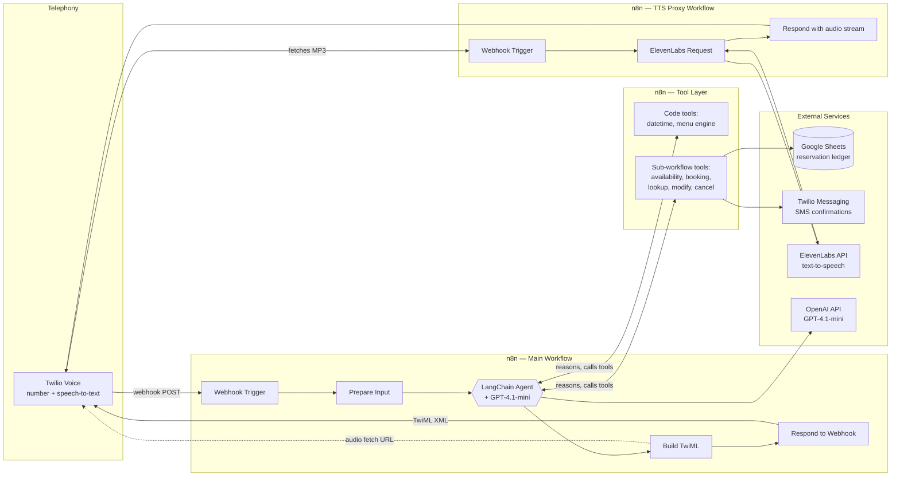
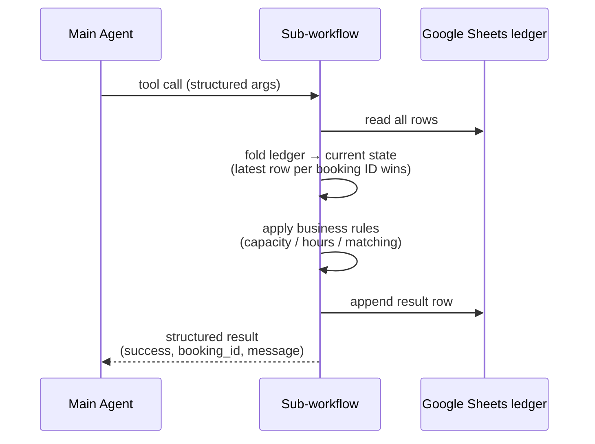
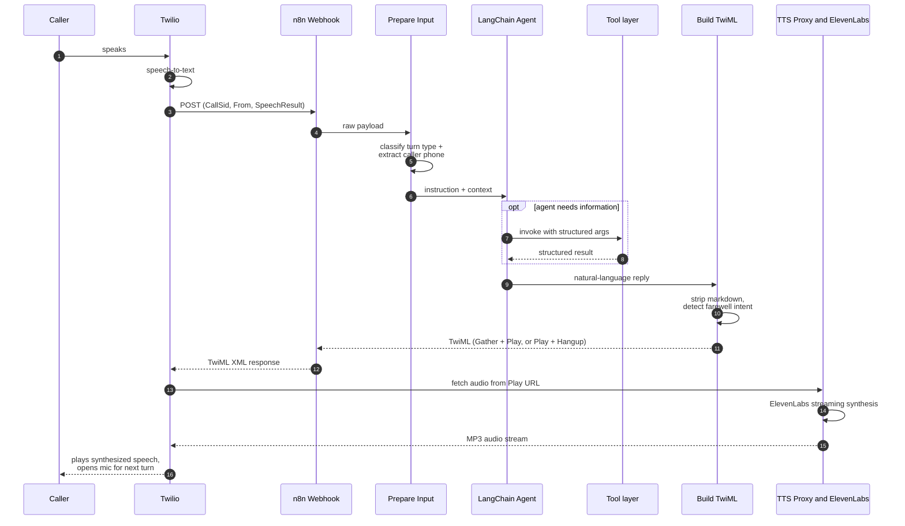

# Architecture

This document describes how the system is put together: the runtime components, how a single phone call moves through them, how state is managed, and how failures are handled. It deliberately stops short of source code — the goal is to convey *how the pieces fit*, not to reproduce the implementation.

---

## System Overview

The agent is built as a graph of orchestrated workflows running on a self-hosted **n8n** instance (Docker), fronted by **Twilio Voice** for telephony and backed by **Google Sheets** for data persistence. There is no custom application server — the entire call-handling pipeline, from "phone rings" to "TwiML response sent," lives inside one n8n workflow and the sub-workflows it calls.

---

## Components

### 1. Twilio Voice (Telephony Edge)

Owns the phone number, answers incoming calls, performs speech-to-text on the caller's spoken input, and executes whatever TwiML instructions the backend returns. It is also the audio playback engine — when the backend wants the caller to hear something, it returns a `<Play>` verb pointing at an audio URL, and a `<Gather>` verb to listen for the next response.

Twilio is also used outbound: the booking sub-workflow sends SMS confirmations through the Twilio Messaging API, reusing the same account credentials already configured for voice.

### 2. Main Conversation Workflow (n8n)

The heart of the system. A single webhook endpoint receives every event for every call — first ring, every subsequent utterance, and silence timeouts alike. From there:

- **Prepare Input** — normalizes the incoming Twilio payload into a clean shape: caller phone number (E.164, extracted from the `From` field), the transcribed speech (if any), the call identifier (`CallSid`), and a classification of *what kind of turn this is* (first contact / caller spoke / caller went silent). This classification becomes a single, unambiguous instruction passed to the agent — the agent never has to guess what triggered this invocation.

- **LangChain Agent (GPT-4.1-mini)** — the conversational brain. Given the system prompt (restaurant identity, personality, business rules, tool descriptions, conversational constraints) plus the per-turn instruction and conversation memory, it decides what to say and which tools (if any) to call, then produces the natural-language reply.

- **Call Memory** — a windowed conversation buffer, scoped per call via `CallSid`, holding up to 30 turns of history. This is what lets the agent reference something the caller said three exchanges ago without re-stating it.

- **Build TwiML** — takes the agent's natural-language reply and turns it into a valid Twilio response: strips any markdown that slipped through, decides whether this is a *continue the conversation* turn (`<Gather>` re-opens the mic) or a *the conversation is over* turn (farewell language detected → play final message and `<Hangup/>`), and assembles the audio playback URL pointing at the TTS proxy.

- **Respond to Webhook** — returns the assembled TwiML directly as the HTTP response to Twilio's original POST. One request in, one response out — no async callbacks.

### 3. Tool Layer

The agent has seven tools available, split across two execution models based on what each tool needs to do:

**Pure-computation tools** (`toolCode` nodes — sandboxed JavaScript, no network access):
- `get_current_datetime` — returns today's/tomorrow's date and time, formatted naturally for the restaurant's timezone (Europe/London)
- `query_menu` — a self-contained menu engine: structured data for every category (starters, sharing platters, boils, mains, burgers, sides, drinks, desserts, kids' menu), a keyword router that maps natural-language queries to the right category, dedicated handlers for common cross-cutting questions (allergens, price ranges), and a fuzzy-search fallback that returns the best-matching items for anything that doesn't fit a known pattern

**I/O-bound tools** (`toolWorkflow` nodes — delegate to full sub-workflows with normal network access):
- `check_availability`, `make_booking`, `lookup_booking`, `modify_booking`, `cancel_booking` — each backed by its own n8n workflow (see below)

This split exists because of a concrete platform constraint: n8n's sandboxed code-tool environment blocks outbound HTTP (`fetch`, `$helpers`, and `require('http')` are all unavailable inside it). Tools that only compute can live there safely and instantly; tools that need to read/write external state are delegated to sub-workflows, which run outside the sandbox with full node capabilities. The agent's view of all seven tools is identical — clean name, description, and parameter schema — so this split is invisible above the tool-calling layer.

### 4. Reservation Sub-Workflows (n8n)

Five independent workflows, each triggered via `executeWorkflowTrigger` when the agent calls the corresponding tool. Each follows the same shape:

- **Check Availability** — applies per-weekday opening hours, a "last seating" buffer before closing time, a maximum-covers ceiling, and natural-language date parsing (so "the first of March" and "01/03" resolve to the same slot)
- **Make Booking** — generates a unique booking reference, appends a confirmed reservation row, then sends an SMS confirmation via the Twilio Messaging API containing the reference, party size, and a number to call to cancel
- **Lookup Booking** — finds a reservation by booking reference, phone number, or fuzzy name match
- **Modify Booking** — appends a new confirmed row under the same booking ID with updated fields (date/time/party size/notes)
- **Cancel Booking** — appends a new row with `status: cancelled` — the original booking record is never altered or removed

### 5. Data Layer — Google Sheets as an Event-Sourced Ledger

Reservation data lives in a Google Sheet, accessed via the official Sheets API (OAuth2). Rather than treating it like a row-per-record database (which would create read-modify-write race conditions with no transaction support), the system treats it as an **append-only event log**:

| Column | Purpose |
|---|---|
| `ID` | Booking reference (stable across the booking's lifetime) |
| `Name` | Guest name |
| `Phone` | Guest phone number |
| `Date` / `Time` | Requested reservation slot |
| `Party Size` | Number of covers |
| `Notes` | Dietary requirements / special requests |
| `Status` | `confirmed` or `cancelled` |
| `Created At` | Timestamp of this ledger entry (not the booking's original creation) |

Every operation — create, modify, cancel — **appends** a new row rather than mutating an existing one. "Current state" for any booking ID is computed by folding the log: take every row with that ID, sort by entry order, and the last one wins. A cancelled-then-rebooked reservation, for instance, has a complete, inspectable history of exactly what happened and when — for free, as a side effect of the storage model rather than a deliberately engineered audit feature.

### 6. TTS Proxy Workflow (n8n)

A small, separate workflow whose only job is to sit between Twilio's audio fetch and the ElevenLabs streaming API:

1. Receives a request (triggered by the `<Play>` URL Twilio fetches)
2. Calls the ElevenLabs streaming text-to-speech endpoint with carefully tuned parameters (model, latency optimization level, output format, voice settings — see [Technical Decisions](TECHNICAL_DECISIONS.md))
3. Streams the resulting audio back as the HTTP response, which Twilio plays directly to the caller

Keeping this as its own workflow (rather than inline in the main one) means the audio-generation step can be triggered, tested, and iterated on completely independently of the conversation logic — and means Twilio is fetching from a stable, dedicated URL.

---

## Request Lifecycle — Single Turn

Every turn — including the very first "hello" and including silence check-ins — flows through this exact same pipeline. There is no special-cased "greeting endpoint": the `Prepare Input` node's classification of *first contact* simply produces a different instruction for the agent, which then behaves accordingly (including triggering the returning-caller lookup before it speaks).

---

## State & Memory Model

| Concern | Mechanism | Scope |
|---|---|---|
| Conversation context within a call | Windowed memory buffer (last 30 turns) | Keyed by `CallSid` — exists only for the duration of one call |
| Returning-caller recognition | Lookup against the reservation ledger by phone number | Triggered explicitly on first contact, not stored as session state |
| Reservation records | Append-only event log in Google Sheets | Persistent, durable, fully auditable |
| Menu data | Static structured data inside the `query_menu` tool | Loaded fresh on every invocation — always consistent, never stale |

Notably, there is **no database** in the conventional sense and **no server-side session store** — every piece of state either lives in the call-scoped memory buffer (ephemeral) or the Sheets ledger (durable), and both are addressed by natural keys (`CallSid`, phone number, booking ID) rather than custom session tokens.

---

## Error Handling & Resilience

- **TTS fallback** — if the ElevenLabs proxy fails to return audio, Twilio's native `<Say>` voice is used as a silent fallback so the call continues rather than dropping
- **Silence handling** — Twilio's own timeout mechanism re-invokes the webhook when a caller goes quiet; `Prepare Input` recognizes this case explicitly and instructs the agent to check in naturally ("Are you still there?") rather than ending the call abruptly
- **Defensive output sanitization** — the `Build TwiML` step strips markdown artifacts from the agent's output even though the system prompt explicitly forbids producing them, on the principle that speech synthesis must never be handed text it can't render naturally
- **Escalation as a designed path, not a failure mode** — the agent's instructions define explicit conditions (repeated misunderstanding, complaints, large parties, food-safety concerns, medical emergencies) under which it stops trying to resolve things itself and redirects the caller appropriately — including a hard override for medical emergencies that bypasses all other logic and points the caller to 999
- **Idempotent, non-destructive writes** — because every ledger write is an append, there's no operation in the system that can corrupt or lose a previous record; the worst case of a retried operation is a duplicate ledger entry, which the state-folding logic already resolves correctly (latest wins)

---

## Why This Shape?

The architecture optimizes for three things simultaneously, which is the actual hard part of a project like this:

1. **Conversational latency** — every component on the hot path (webhook → agent → tools → TwiML → audio) is chosen and tuned to minimize the gap between "caller stops talking" and "agent starts responding," because that gap is the single biggest determinant of whether a phone conversation feels natural or robotic
2. **Operational transparency** — both for the engineer (n8n's execution traces make every call individually debuggable after the fact) and for the client (Google Sheets gives restaurant staff a live view of their bookings with no technical onboarding)
3. **Safety under autonomy** — because this agent operates with zero human review of its conversations or its actions, the guardrails (escalation rules, GDPR-conscious data collection, non-destructive writes, hard overrides for emergencies) aren't an afterthought; they're load-bearing parts of the design

See [`TECHNICAL_DECISIONS.md`](TECHNICAL_DECISIONS.md) for the reasoning behind individual choices, and the README's [Conversation Design](README.md#conversation-design) section for how these components combine to shape the experience of an actual phone call.
