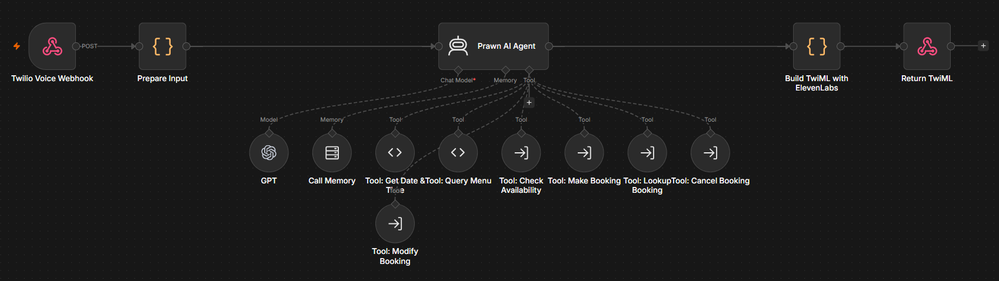
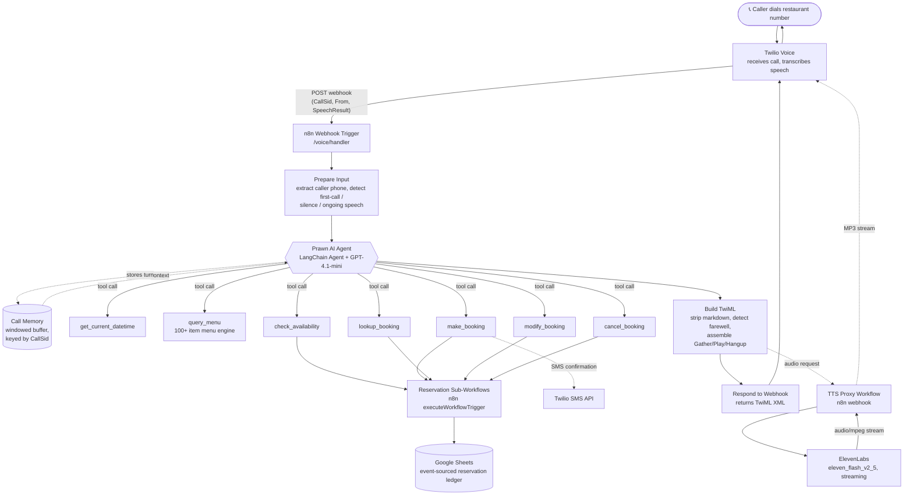

[← Back to AI Automations Portfolio](../README.md)

# Prawn — AI Voice Agent for Restaurant Call Handling

**An AI phone agent that handles a restaurant's calls, runs the entire reservation lifecycle, and answers any menu question — in natural, low-latency conversational speech, with no human in the loop.**

✅ **Built and working end-to-end** — a complete AI phone agent for Shrimp & Co, a seafood restaurant. The full call → availability → booking → SMS-confirmation flow runs through real phone calls.


> Built solo, end-to-end — conversation design, telephony plumbing, agent orchestration, latency tuning, and the data layer.

<!-- Add a Loom recording of a live sample call here, e.g.: -->
<!-- [](https://www.loom.com/share/your-demo-link) -->
<!--  -->

---

## The Problem

Restaurants lose money every time a call goes unanswered during a dinner rush — a missed reservation is a missed table, and every minute staff spend reciting opening hours or describing menu items is a minute not spent on the floor. Most "AI receptionist" products either sound robotic, can't actually *do* anything beyond taking a message, or need an engineering team to stand up.

## The Solution

Prawn is a production phone agent that picks up, sounds like a person, and actually closes the loop: it checks table availability against real opening hours and capacity, books the table, texts a confirmation, remembers returning callers, and can answer detailed questions about a 100+ item menu — all inside a single phone call, with response latency tuned specifically for the back-and-forth rhythm of natural speech.

---

## What It Does

**Reservation lifecycle (fully autonomous, no human in the loop)**
- **Check availability** — cross-references requested date/time/party size against per-day opening hours, a "last seating" buffer before close, and live capacity for that slot
- **Book** — creates a reservation, generates a reference code, and **sends an SMS confirmation** via Twilio with the booking ref, party size, and a cancellation number
- **Look up** — finds an existing booking by name, phone number, or reference code
- **Modify** — changes the date, time, party size or notes on an existing booking
- **Cancel** — cancels with full audit trail (nothing is ever destructively deleted — see [Architecture](ARCHITECTURE.md))

**Returning-caller recognition**
- Reads the caller's number directly off the inbound Twilio payload and looks up their booking *before* the greeting plays — a returning guest is welcomed by name with their upcoming reservation mentioned upfront, a new caller gets a warm first-time greeting

**Full menu intelligence**
- A dedicated menu engine covers 100+ items across starters, signature shrimp platters, sharing boards, seafood boils, chicken, burgers, pasta, kids' meals, sides, drinks and desserts — with prices, descriptions, spice levels, dietary flags and allergen guidance
- The agent is explicitly forbidden from describing dishes "from memory" — every menu answer is sourced live from the menu engine, which eliminates hallucinated prices or invented dishes

**Conversational intelligence**
- Multi-turn memory scoped per phone call (so context survives across the whole conversation, not just one exchange)
- Silence handling — if the caller goes quiet, the agent checks in naturally rather than hanging up
- Natural goodbye detection — recognises when the conversation has reached a close and ends the call gracefully instead of asking "anything else?" forever
- Escalation rules for complaints, large groups, and medical emergencies (with a hard-coded redirect to 999 for the latter)

**Compliance by design**
- Only collects the data it needs to fulfil a booking (name, phone, date, time, party size, dietary notes) — no payment details are ever requested, per UK GDPR guidance baked into the agent's instructions

---

## Architecture



The system is a **single round trip per conversational turn**: Twilio posts the transcribed speech to one webhook, the agent reasons over it (calling whatever tools it needs along the way), and the response comes back as TwiML that both plays synthesized audio *and* re-opens the microphone for the next turn — all in one HTTP response. There's no polling, no client-side state, and no custom telephony server to operate.

---

## Tech Stack

| Layer | Technology | Why |
|---|---|---|
| **Telephony** | Twilio Voice (`<Gather>`, `<Play>`, speech-to-text) | Industry-standard voice infrastructure with built-in transcription — no need to run an STT pipeline |
| **Orchestration** | n8n (self-hosted, Docker) | Visual, debuggable node graphs replace a hand-rolled webhook server; every call's execution is inspectable node-by-node after the fact |
| **Conversational AI** | OpenAI GPT-4.1-mini via LangChain Agent node | Native function-calling for tool use, fast enough for real-time voice, cheap enough to run per-turn |
| **Agent framework** | LangChain (`@n8n/n8n-nodes-langchain`) | Gives the agent windowed conversation memory and a clean tool-calling abstraction without writing the orchestration loop by hand |
| **Voice synthesis** | ElevenLabs (`eleven_flash_v2_5`, streaming) | The most natural-sounding TTS available, with a model purpose-built for low-latency real-time use |
| **Data store** | Google Sheets (OAuth2, append-only) | Restaurant staff can open the booking ledger directly with zero technical setup — and the append-only pattern sidesteps the concurrency problems a naive spreadsheet-as-database design would normally hit |
| **SMS** | Twilio Messaging API | Reuses the same Twilio account already wired up for voice — booking confirmations land in the guest's pocket seconds after the call ends |
| **Reference backends** | Node.js/Express, Python/FastAPI | Two parallel hand-written implementations of the same agent exist in the repo as a portability proof — the production system runs on n8n, but the logic translates directly to a conventional backend if needed |

---

## Reservation Sub-Workflow Architecture

Each booking operation (`check_availability`, `make_booking`, `lookup_booking`, `modify_booking`, `cancel_booking`) is its own n8n workflow, invoked by the agent as a callable tool via `executeWorkflowTrigger`. This keeps the main conversation graph readable while letting each operation be tested, versioned and debugged independently:

```
Main Agent
   │  (tool call with structured arguments: date, time, party_size, name, phone, booking_id…)
   ▼
Sub-workflow entry (When Called by Another Workflow)
   ▼
Read the reservation ledger from Google Sheets
   ▼
Fold the event log into "current state" (latest row per booking ID wins)
   ▼
Apply the operation's business rules (capacity check, opening hours, fuzzy match, etc.)
   ▼
Append the result as a new ledger row  →  Google Sheets
   ▼
Return a structured result to the agent (success, booking_id, human-readable message)
```

`make_booking` has one extra step: after the ledger write succeeds, it formats the guest's number to E.164, builds a confirmation message with the booking reference and cancellation number, and fires it through the Twilio Messaging API — entirely independent of the voice call still in progress.

---

## Key Technical Decisions

**1. n8n over a hand-rolled backend**
The repo actually contains two complete reference servers (Node/Express and Python/FastAPI) that implement the same agent logic with OpenAI function calling. The production system runs on n8n instead. *Why:* conversation logic changes constantly during development — tweaking a tool description, adjusting the system prompt, adding a new escalation rule. n8n turns each of those into a visual edit with an instant test-run and a node-by-node execution trace, instead of a deploy cycle. The trade-off is less flexibility for truly custom logic — which is exactly why the menu engine and the booking math are pushed into Code nodes rather than fought with visually.

**2. Google Sheets as an event-sourced ledger, not a database**
A full PostgreSQL schema exists in the repo (`database/schema.sql`) — reservations table, indices, triggers, the works — but production runs on Sheets. *Why:* the realistic alternative to "engineer hosts a database" is "restaurant staff can't see their own bookings without asking the engineer." Sheets gives the client direct visibility and zero hosting cost. The catch is that spreadsheets have no transactions — so every write is an **append**, never an update or delete, and every read **folds the log down to current state** by taking the most recent row per booking ID. A cancellation doesn't erase a booking; it appends a new row with `status: cancelled` on top of it. The result is a full audit trail for free, and no read-modify-write race conditions to worry about.

**3. ElevenLabs over Twilio's built-in TTS, tuned specifically for phone-call latency**
Twilio's native `<Say>` is instant but sounds synthetic; ElevenLabs sounds convincingly human but is slower by default. The fix wasn't just "pick the better-sounding one" — it was tuning the *specific* parameters that trade voice fidelity for speed: the `eleven_flash_v2_5` model (purpose-built for real-time), `optimize_streaming_latency` set to its maximum, streaming MP3 output, and voice settings with style processing disabled (style adds noticeable latency for negligible gain on a phone line). Twilio's `<Say>` remains as a silent fallback only for the rare case where the TTS proxy itself fails.

**4. Two-tier tool architecture: sandboxed code vs. delegated sub-workflows**
n8n's `toolCode` nodes run in a sandbox that blocks outbound HTTP entirely (`fetch`, `$helpers`, `require('http')` are all unavailable). That's perfect for pure-computation tools — `get_current_datetime` and the menu engine need no I/O. But booking operations need to read and write Google Sheets and send SMS. The solution: those tools are `toolWorkflow` nodes that delegate to full sub-workflows, which run with normal node capabilities. The agent doesn't know or care about this split — it just sees seven tools with clean descriptions.

**5. Single-webhook conversational loop**
Rather than separate "greet" and "respond" endpoints, one webhook handles the entire conversation. A small `Prepare Input` node inspects the incoming payload and classifies it into exactly one of three states — *first contact*, *caller went silent*, or *caller said something* — and hands the agent a single, unambiguous instruction either way. This keeps the conversation graph linear and means there's exactly one place where "what kind of turn is this?" gets decided.

**6. Returning-caller recognition as a first-class conversational primitive**
Rather than bolting "remember the customer" on as an afterthought, the caller's phone number is extracted from the very first webhook payload and the agent is *instructed* — as part of its very first message — to look the number up before it even says hello. If a match is found, the greeting itself changes. This turns a generic phone tree into something that feels like calling a restaurant where they actually know you.

---

## Conversation Design

**Greeting that adapts to who's calling.** The first message the agent receives isn't a static "hello" — it's a dynamically constructed instruction that already contains the caller's phone number and a directive to check whether they're a returning guest *before* speaking. The agent effectively does its homework in the milliseconds before the first word is spoken.

**Speech-shaped responses, not chat-shaped ones.** The system prompt enforces phone-call-appropriate behaviour throughout: a hard cap on response length, exactly one question per turn (never stacked), natural phrasing for dates and times ("the fifteenth of March" rather than "15/3"), and an explicit ban on markdown or bullet points — because nobody can "hear" a bullet point. A defensive cleanup pass in the TwiML builder strips any markdown artifacts that slip through anyway before the text reaches the speech synthesiser.

**Memory scoped to the call, not the customer.** Conversation history is held in a windowed buffer keyed by Twilio's `CallSid` — giving the agent rich context for a single call (up to 30 turns) without any cross-call data retention concerns.

**Knowing when to stop talking.** Two small but important behaviours: silence detection (if the caller goes quiet, Twilio redirects with a flag the agent interprets as "check in, don't hang up") and farewell detection (the TwiML builder scans the agent's own response for sign-off language — "goodbye", "have a lovely evening", "take care" — and ends the call cleanly with a final message instead of re-opening the microphone and waiting awkwardly for a reply that isn't coming).

**Escalation as policy, not improvisation.** The agent's instructions spell out exactly when to hand off to a human — repeated misunderstanding, unresolved complaints, large group bookings, food safety concerns — and treat medical emergencies as a hard override: stop everything, direct the caller to call 999, end the call.

---

## Results / Impact

**Status: built and working.** The complete flow — inbound call → availability check → booking → SMS confirmation, plus full menu Q&A — runs end-to-end on real phone calls, with no human in the loop.

<!-- Add real metrics here once you have a few weeks of call data, e.g.:
- Calls handled per week: __
- Average call duration: __
- Reservation completion rate: __
- Escalation-to-human rate: __
-->

---

## Further Reading

- [`ARCHITECTURE.md`](ARCHITECTURE.md) — full system architecture, request lifecycle, and error-handling, including a turn-by-turn sequence diagram of a live call
- [`TECHNICAL_DECISIONS.md`](TECHNICAL_DECISIONS.md) — the reasoning, alternatives, and trade-offs behind each major engineering choice
- [`API_DOCUMENTATION.md`](API_DOCUMENTATION.md) — the agent's full tool interface and webhook contracts
- [`screenshots/SCREENSHOTS_NEEDED.md`](screenshots/SCREENSHOTS_NEEDED.md) — what's needed to complete the visual walkthrough

---

*Built by Mohammed Waliuddin — solo design, build, and deployment.*
