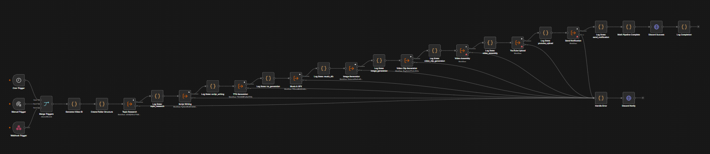
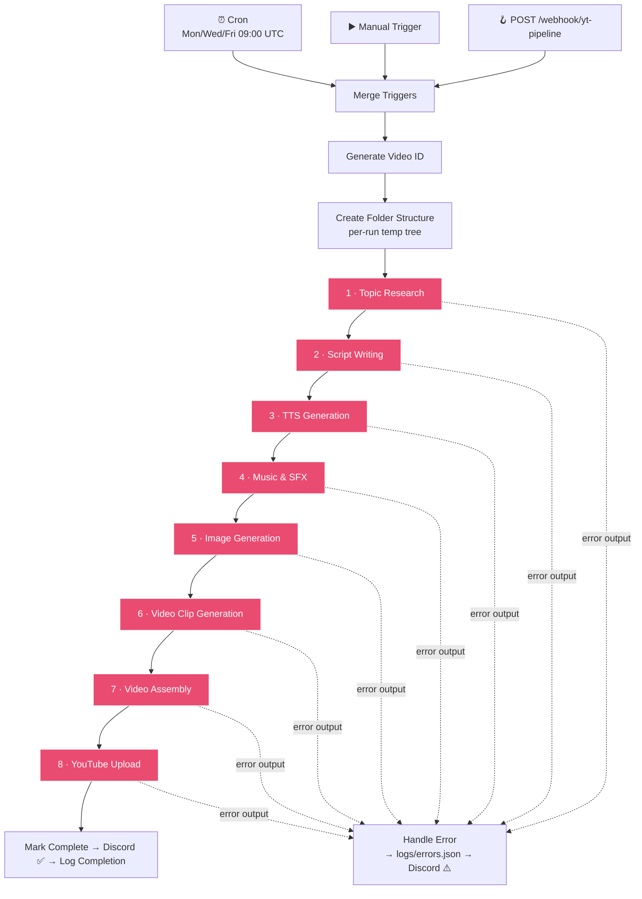

[← Back to AI Automations Portfolio](../README.md)

# YT Master Orchestrator — Fully Automated YouTube Video Production

**A hands-off, end-to-end pipeline that researches a trending topic, writes a documentary script, generates voiceover, music, SFX, AI images and AI video clips, assembles a finished 1080p video, and uploads/schedules it to YouTube — one trigger in, a scheduled video out.**


> 🟡 **Status: built, in development.** Core logic is wired end-to-end across a master orchestrator and 8 specialized sub-workflows (~185 nodes total). The final-stage links and a notification step are mid-wiring — see [Honest Status](#-honest-status) below. Documented as-built, not as-aspirational.



*The master orchestrator: three triggers (cron / manual / webhook) merge into a single linear pipeline that drives all 8 sub-workflow stages, with each stage's error output routed down to a single `Handle Error → Discord Notify` rail (bottom-right).*

---

## The Problem

Producing a single polished mini-documentary is a multi-skill, multi-hour grind. By hand, one video means:

1. Trawling Reddit / Hacker News / YouTube for ideas and guessing which will land
2. Scripting a 10-minute narrative with a real hook and structure
3. Recording narration
4. Sourcing or animating visuals, scene by scene
5. Composing or licensing music and sound effects
6. Editing it all together in a video editor
7. Rendering to 1080p
8. Writing SEO title, description, chapters, tags, and thumbnails
9. Uploading and scheduling the publish

That's hours to days of skilled creative work per upload — the exact reason most "faceless YouTube" channels stall after a handful of videos. The bottleneck isn't ideas; it's the production chain.

## The Solution

A single n8n master workflow that **collapses that entire chain into one trigger**. It mines and scores trending topics with AI, writes a structured documentary script, generates every asset (voice, music, SFX, images, AI video), assembles a finished `.mp4` with mixed audio and burned subtitles, and uploads it to YouTube as a scheduled, metadata-complete video — producing a finished film in roughly **20–40 minutes with zero human steps in between**.

The whole thing is built as a **master orchestrator driving 8 self-contained sub-workflows**, each independently runnable and testable.

---

## What It Does — The Pipeline

```
Trigger (cron / manual / webhook)
   │
   ▼
1. Topic Research      Mines 5 subreddits + Hacker News + YouTube autocomplete →
                       filters by score, dedupes → Claude scores every candidate →
                       Claude expands the #1 topic into title / hook / angle / keywords
   ▼
2. Script Writing      Claude gathers concrete facts → writes a Kurzgesagt-style
                       documentary as strict JSON → self-heals invalid JSON via a
                       dedicated Claude repair pass → extracts asset arrays
   ▼
3. TTS Generation      ElevenLabs voices each narration section → ffprobe measures
                       durations → builds a timing manifest with 0.4s gaps →
                       concatenates a master voiceover track
   ▼
4. Music & SFX         Groups sections by mood → ElevenLabs Music generates
                       instrumental beds → ElevenLabs Sound-Generation creates
                       per-cue SFX
   ▼
5. Image Generation    Enhances each visual prompt → fal.ai Flux Pro v1.1 generates
                       1920×1080 scene images + 3 thumbnail variants → ImageMagick
                       burns text overlays on thumbnails
   ▼
6. Video Clips         Classifies each scene: cheap FFmpeg "Ken Burns" zoom/pan for
                       flat scenes, premium fal.ai Kling AI video for cinematic ones —
                       with automatic Ken Burns fallback if Kling times out
   ▼
7. Video Assembly      Normalizes all clips to 1080p/30fps → concatenates → ducks
                       music to 15% → mixes voice + music + SFX → burns subtitle
                       overlays → ffprobe-verifies → outputs <video_id>_final.mp4
   ▼
8. YouTube Upload      Builds SEO metadata + chapters → resumable upload via YouTube
                       Data API v3 → sets thumbnail → computes the next free publish
                       slot → schedules → posts a Discord "Ready for Review" embed
   │
   ▼
Discord ✅ "Pipeline Complete"  +  finished MP4  +  scheduled YouTube video  +  tracking log
```

Every stage writes its state and timings to a per-run `pipeline_state.json`, so a run is fully diagnosable stage-by-stage.

---

## Architecture at a Glance

The master orchestrator is linear with a dedicated error rail. Every `executeWorkflow` node's error output routes to a single handler that logs the failure and pings Discord — one stage failing notifies the operator instead of dying silently.



Each numbered stage is its own n8n sub-workflow with its own Manual + Execute-Workflow trigger, so it can be developed and tested in isolation. See **[ARCHITECTURE.md](ARCHITECTURE.md)** for the node-by-node internals of every sub-workflow.

---

## Tech Stack

| Layer | Technology | Why |
|---|---|---|
| **Orchestration** | n8n (self-hosted) — `executeWorkflow`, `splitInBatches`, Code nodes | Master/sub-workflow pattern keeps a 185-node system modular and debuggable stage-by-stage |
| **LLM** | Anthropic Claude Sonnet (`claude-sonnet-4`) via raw HTTP | Topic scoring, topic expansion, fact-gathering, scriptwriting, and JSON self-repair — 5 distinct Claude calls |
| **Voice** | ElevenLabs TTS (`eleven_multilingual_v2`) | Per-section narration → concatenated master voiceover |
| **Music & SFX** | ElevenLabs Music + Sound-Generation | Mood-grouped instrumental beds + per-cue sound effects |
| **Images** | fal.ai Flux Pro v1.1 | 1920×1080 scene images + 1280×720 thumbnails |
| **AI Video** | fal.ai Kling Video v2 (image-to-video) | Cinematic motion clips for high-impact scenes |
| **Media processing** | FFmpeg / FFprobe + ImageMagick | Ken Burns animation, normalization, audio mixing, subtitle burn, thumbnail overlays |
| **Topic mining** | Reddit JSON API, Hacker News Firebase API, Google autocomplete | Multi-source candidate pool with score thresholds |
| **Publishing** | YouTube Data API v3 (resumable upload) | Upload, thumbnail, privacy + scheduled `publishAt` |
| **Notifications** | Discord webhooks | Success, error, and "ready for review" embeds |

---

## Key Technical Decisions

**1. Hybrid, cost-aware visuals.**
Not every scene needs a paid AI video clip. A `Classify Scenes` step routes flat-style or long (>10s) scenes to a **free local FFmpeg "Ken Burns" zoom/pan** over a still image, and sends only genuinely cinematic scenes to **paid fal.ai Kling** image-to-video. Kling is then *also* the timeout fallback's opposite — if a Kling generation exceeds ~5 minutes, the pipeline auto-generates a Ken Burns clip instead. The result: every scene gets a clip, premium spend goes only where it shows, and a slow API never stalls the run.

**2. LLM output is treated as untrusted, with a repair loop.**
Rather than assume Claude returns valid JSON for a 2,000-word structured script, the Script Writing workflow validates structure and word count, and runs a dedicated Claude "fix this JSON" pass **only when parsing fails** (IF-gated), then re-validates. Warnings (word count high/low, missing sections/thumbnails) are carried downstream rather than thrown. This is the production-grade pattern for any LLM step whose output another step depends on.

**3. Manifest-driven, file-on-disk architecture.**
Each stage emits a small JSON manifest and writes heavy media (MP3s, PNGs, MP4s) to a `video_id`-scoped temp tree. Downstream stages read *paths*, not payloads. This keeps n8n item sizes tiny, makes the pipeline debuggable stage-by-stage, and lets a single shared **timing manifest** (ffprobe durations + fixed 0.4s gaps) be reused for audio gaps, music alignment, subtitle timing, *and* YouTube chapter markers.

**4. Three triggers, one entry point.**
Cron (Mon/Wed/Fri 09:00 UTC), Manual, and Webhook all feed a single Merge node — so the same pipeline serves scheduled production, on-demand runs, and external API invocation without duplicated logic.

**5. Conflict-free auto-scheduling.**
`Calculate Next Publish Slot` scans up to 21 days ahead for the next open Mon/Wed/Fri publish slot, honors a 15-minute buffer, persists taken slots to disk, and falls back to "+7 days" — so two videos can never be scheduled to the same minute.

**6. Resilience baked into every external call.**
Bounded polling everywhere (images 40×3s, Kling 30×10s, etc.), SFX failures fall back to silence so the mix never breaks, every FFmpeg/ffprobe shell-out captures `exitCode`/`stderr` in a try/catch, and the upload step errors loudly if the resumable upload returns no `Location` header.

---

## Numbers / Scale

- **Cadence:** 3 videos/week (Mon/Wed/Fri), ~20–40 min run time per video
- **Topic mining:** 5 subreddits (25 posts each) + 15 HN stories + 5 YouTube autocomplete queries; Reddit score ≥ 500, HN ≥ 100; Claude narrows to top 5 → 1
- **Script:** ~10-min target, 5+ sections, ~1,200–2,500 validated words (8,000 max tokens for the script call)
- **Audio mix:** voice 100% / music ducked to 15% / SFX 50%; 0.4s inter-section gaps; 2s-in / 3s-out music fades
- **Render specs:** 1920×1080, 30fps, H.264 CRF 18, AAC 192k, burned subtitles
- **Thumbnails:** 3 variants per video at 1280×720
- **System size:** master orchestrator (29 nodes) + 8 sub-workflows (~156 nodes) = **~185 nodes**

---

## 🔍 Honest Status

This is documented **as-built**, not as-marketed. The pipeline is in **development**:

- All 9 workflows are currently inactive on the live n8n instance (the active workflows there are the unrelated restaurant booking + voice systems).
- Core logic is fully built end-to-end, but the orchestrator's final sub-workflow links (Video Assembly → YouTube Upload) and a "Send Notification" step are still being wired.
- Secrets are injected via `$env.*` directly into HTTP calls (no n8n credential objects) — a deliberate choice for portability that's noted in the setup guide.

I'd rather show a real, ambitious system with its rough edges labeled than a polished fiction. The engineering patterns here — modular sub-workflows, untrusted-LLM repair loops, manifest-driven media pipelines, cost-aware generation — are the transferable parts.

---

## Further Reading

- **[ARCHITECTURE.md](ARCHITECTURE.md)** — node-by-node internals of the orchestrator and all 8 sub-workflows, the full data-flow map, and the error-handling model
- **[screenshots/SCREENSHOTS_NEEDED.md](screenshots/SCREENSHOTS_NEEDED.md)** — what visuals would complete this showcase

---

*Built by Mohammed Waliuddin — solo design and build. Part of the [Aether AI automations portfolio](../README.md).*
